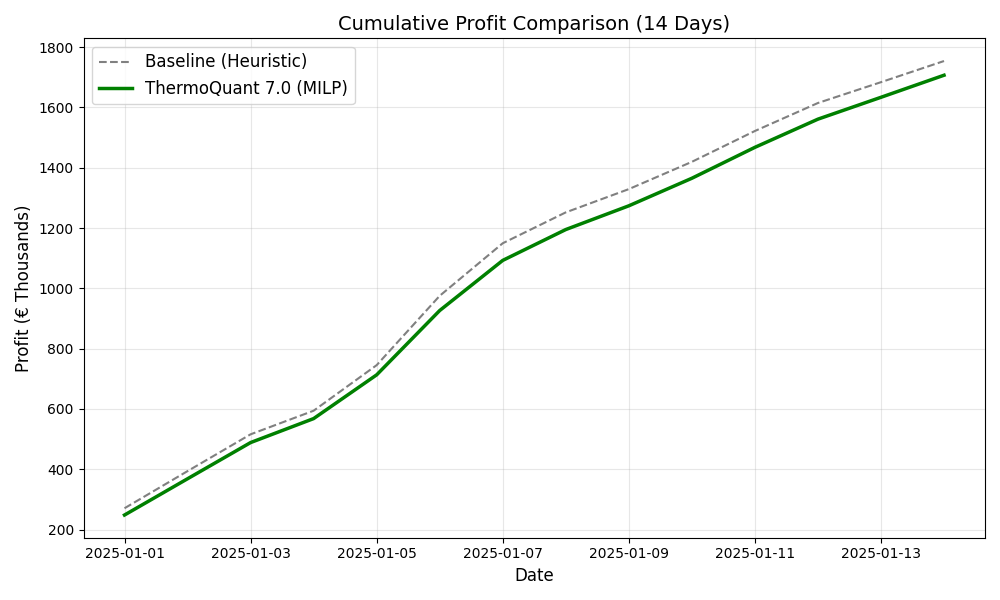

# ThermoQuant: Physics-Constrained VPP Optimization

**ThermoQuant** is an open-source Python framework for the techno-economic optimization of a Green Hydrogen Virtual Power Plant (VPP). It integrates **Physics-Based Surrogate Models** with **Mixed-Integer Linear Programming (MILP)** to ensure that financial arbitrage strategies remain physically feasible within the German day-ahead energy market.

## 🚀 The Challenge & Solution
Standard linear optimization tools often overestimate revenue by ignoring "hidden physics," such as thermal saturation in district heating networks or non-linear electrolyzer efficiency at partial loads. 

ThermoQuant bridges the gap between engineering physics and financial dispatch. By deriving surrogate models from high-fidelity physics engines and embedding them into a MILP solver, the framework accurately quantifies the **"Cost of Physics"**—the revenue that must be sacrificed to ensure safe, real-world operation.

## ⚙️ System Architecture
The framework co-optimizes a 170 MW Hybrid Plant against hourly 2025 DE/LU SMARD market data:
* **Gas Turbine (100 MW):** Modeled with minimum load constraints (20%) and binary commitment variables.
* **PEM Electrolyzer (50 MW):** Uses a piecewise-linear surrogate model (derived from TESPy) to capture efficiency drops at low loads, plus thermal ramp-rate limits (25 MW/h).
* **Battery Storage (20 MWh):** Integrates SEI-growth degradation costs (derived from PyBaMM) to prevent unprofitable micro-cycling.
* **Industrial Heat Pump (20 MW):** Sector-coupled to provide District Heating, strictly bounded by a 40 MWth network capacity limit.

## 📊 Key Results & Financial Impact
Running the physics-constrained optimizer over the 2025 market data yields an investment-grade financial profile:

* **Annual Operating Profit:** €56.78 Million
* **Estimated CAPEX:** ~€106 Million
* **Simple Payback Period:** ~2.0 Years

### The "Cost of Physics"


*Figure 1: Comparative analysis showing cumulative profit over a 14-day sample.* The baseline heuristic controller (Grey) blindly dispatches assets, overestimating revenue by ignoring network limits. The ThermoQuant MILP (Green) recognizes that the district heating pipes are full, automatically throttling the Heat Pump. This physically enforced realism results in a **~2.7% reduction** in theoretical profit, providing a highly accurate, de-risked financial projection.

## 🛠️ Tech Stack
* **Optimization Engine:** `Pyomo`
* **Solver:** `HiGHS` (Open-Source)
* **Data Processing:** `Pandas`, `NumPy`
* **Visualization:** `Matplotlib`

## 📂 Repository Structure
* `vpp_optimizer.py`: The core MILP engine utilizing surrogate-assisted physics (ThermoQuant 8.0).
* `vpp_controller.py`: The baseline heuristic controller used for comparative validation.
* `final_comparison.py`: Validation script that runs both models head-to-head and generates the comparative graph.
* `smard_data.csv`: Hourly electricity market data used as the exogenous input.

## 👨‍💻 How to Run
1. Clone the repository to your local machine.
2. Install the required dependencies:
   ```bash
   pip install pandas numpy pyomo highspy matplotlib
